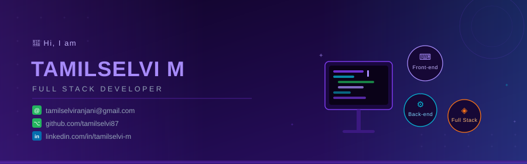

<!-- BANNER -->

  

---

## 🌐 Socials:

---

## 💻 Tech Stack:

---

## 📊 Metrics:

<!-- 3D Isometric Contribution Calendar -->

<!-- Pac-Man / Snake on contribution graph -->
<picture>
  <source media="(prefers-color-scheme: dark)" srcset="https://raw.githubusercontent.com/tamilselvi87/tamilselvi87/output/github-snake-dark.svg" />
  <source media="(prefers-color-scheme: light)" srcset="https://raw.githubusercontent.com/tamilselvi87/tamilselvi87/output/github-snake.svg" />
  
</picture>

---

## 📈 GitHub Stats:

  
  &nbsp;
  

  

---

## 💼 Work Experience:

**🔵 Infosys Springboard Intern 6.0** &nbsp;&nbsp;`Sep 2025 – Dec 2025`
- Developed a web-based application using **HTML, CSS, JavaScript & Java** with structured, user-friendly interfaces
- Gained hands-on experience in **SDLC** — requirement analysis, implementation, testing & debugging following industry best practices

**🟠 Salesforce Developer Intern** &nbsp;&nbsp;`May 2025 – Jul 2025`
- Customized Salesforce apps using **Apex** & **Visualforce**
- Managed data pipelines via **Data Loader** and built **Salesforce Lightning Components** with basic CRM configurations

---

## 🚀 Projects:

| 🗂️ Project | 🛠️ Tech | 📝 Description |
|---|---|---|
| **Smart Govt. Scheme Eligibility & Recommendation System** | HTML, CSS, JS, React, Java, SpringBoot, Mysql | Recommends suitable government welfare schemes based on user eligibility |
| **Study Group Finder & Collaboration Platform** | HTML, CSS, JS, TypeScript, Java, SpringBoot, Mysql | Students discover, create & manage study groups with secure auth & responsive UI |
| **Farm Management Software** | HTML, CSS, JS, Node.js, TensorFlow.js | AI-driven crop health prediction with real-time weather & smart irrigation scheduling |

---

## 🏅 Certifications & Achievements:

- 📘 **NPTEL** – Programming in Java
- ☁️ **NPTEL** – Cloud Computing
- 🌐 **NPTEL** – Internet of Things (IoT)
- 🇯🇵 **Japanese Language** – N5 Level Certified
- 🏆 **Winner** – AI Prompt Generating Competition

---

## 🎓 Education:

**BE CSE** – Mahendra Engineering College &nbsp;&nbsp;`Sept 2026 – Present` &nbsp;| CGPA: **8.76**

---

